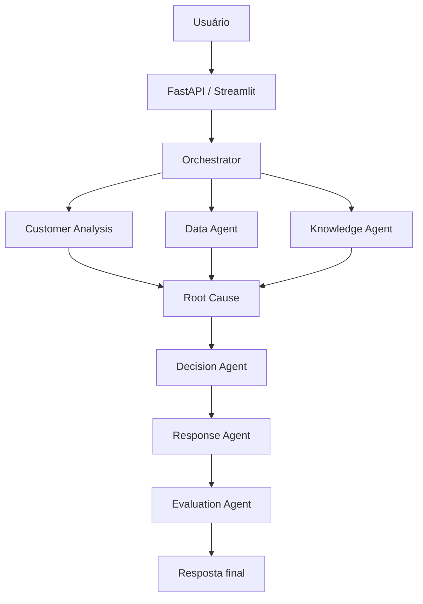

# AI Operations Agent

Sistema multiagente de inteligência operacional para análise, classificação, investigação e automação de solicitações de atendimento.

## Visão geral

Este projeto simula um centro de operação de atendimento que recebe solicitações de clientes e organiza um fluxo de inteligência artificial para:

- entender a intenção do consumidor;
- classificar o tipo de atendimento;
- identificar sentimento e urgência;
- consultar histórico e métricas do cliente;
- recuperar contexto relevante da base de conhecimento;
- analisar causa raiz;
- tomar a decisão de atendimento;
- gerar resposta profissional;
- avaliar a qualidade da resposta;
- registrar a execução em logs estruturados.

## Arquitetura



## Agentes

- Orchestrator: coordena o fluxo e o estado da execução
- Customer Analysis Agent: classifica intenção, categoria, sentimento e prioridade
- Data Agent: consulta dados simulados do cliente, produto e histórico
- Knowledge Agent: recupera documentos relevantes por RAG
- Root Cause Agent: identifica causas prováveis e fatores contribuintes
- Decision Agent: aplica regras determinísticas e justifica decisão final
- Response Agent: gera resposta ao consumidor
- Evaluation Agent: mede qualidade e risco de alucinação

## Tecnologias

- Python
- OpenAI API
- LangChain
- LangGraph
- FastAPI
- Streamlit
- SQLite
- Pydantic
- RAG
- pytest
- Docker

## Estrutura do projeto

```text
ai-operations-agent/
├── app/
├── data/
├── tests/
├── scripts/
├── frontend/
├── docs/
├── .env.example
├── .gitignore
├── requirements.txt
├── Dockerfile
├── docker-compose.yml
├── README.md
└── pytest.ini
```

## Configuração

1. Crie um ambiente virtual.
2. Instale as dependências.
3. Copie o arquivo `.env.example` para `.env`.
4. Informe sua chave da OpenAI.

## Próxima fase

A fase 4 implementa a base de conhecimento local e o Knowledge Agent. A fase 5 adiciona o Root Cause Agent, que combina classificação, tickets, métricas e fontes recuperadas para estimar risco, registrar fatores contribuintes e recomendar a próxima ação. A fase 6 adiciona o Decision Agent, que transforma as evidências em decisões estáveis de escalonamento, investigação ou orientação inicial. A fase 7 adiciona o Response Agent e a fase 8 adiciona o Evaluation Agent, que verifica relevância, conformidade, clareza, completude e risco de alucinação. A fase 9 conecta os oito agentes em um workflow executável e expõe o endpoint `POST /analyze`. A fase 10 persiste auditoria por agente, duração e status, além de expor `GET /executions/{execution_id}`. A fase 11 conecta a interface Streamlit à API real, exibindo resposta, decisão, pontuação e auditoria. A fase 12 adiciona empacotamento Docker com API, frontend, healthcheck e volume persistente para o SQLite. A fase 13 adiciona CI para compilação, testes e build da imagem Docker em cada push ou pull request. A fase 14 adiciona CORS configurável, headers de segurança e o endpoint `GET /ready` para verificar a disponibilidade do banco. A fase 15 adiciona métricas Prometheus-compatible em `GET /metrics`, cobrindo requisições HTTP, latência agregada e resultados do workflow. A fase 16 adiciona rate limiting configurável, templates de secrets e testes de segurança e carga. Os documentos Markdown são indexados em memória e recuperados por correspondência lexical determinística, mantendo a interface preparada para futura substituição por embeddings e um vector store.

Para executar localmente, inicie a API com `uvicorn app.main:app --reload` e, em outro terminal, execute `streamlit run frontend/streamlit_app.py`. A URL da API pode ser alterada por `API_BASE_URL`.

Para validar segurança e carga leve, execute `python -m pytest tests/test_security.py tests/test_load.py -q`. O rate limiting é local ao processo; em múltiplas réplicas, use um gateway ou store compartilhado.

## Observações

Este projeto é pensado como uma solução profissional, modular e extensível, com uso de dados simulados para demonstrar arquitetura multiagente e RAG em um cenário corporativo realista.
