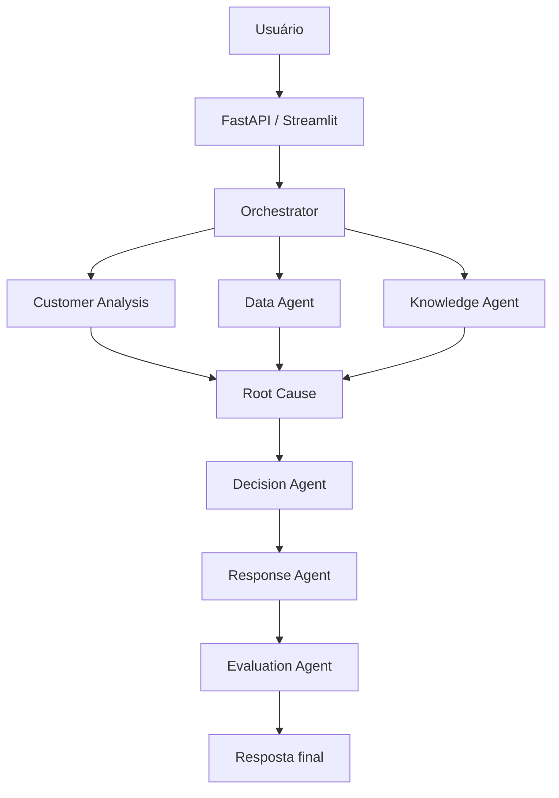

# AI Operations Agent

Sistema multiagente de inteligência operacional para análise, classificação, investigação e automação de solicitações de atendimento.

## Visão geral

Este projeto simula um centro de operação de atendimento que recebe solicitações de clientes e organiza um fluxo de inteligência artificial para:

- entender a intenção do consumidor;
- classificar o tipo de atendimento;
- identificar sentimento e urgência;
- consultar histórico e métricas do cliente;
- recuperar contexto relevante da base de conhecimento;
- analisar causa raiz;
- tomar a decisão de atendimento;
- gerar resposta profissional;
- avaliar a qualidade da resposta;
- registrar a execução em logs estruturados.

## Arquitetura



## Agentes

- Orchestrator: coordena o fluxo e o estado da execução
- Customer Analysis Agent: classifica intenção, categoria, sentimento e prioridade
- Data Agent: consulta dados simulados do cliente, produto e histórico
- Knowledge Agent: recupera documentos relevantes por RAG
- Root Cause Agent: identifica causas prováveis e fatores contribuintes
- Decision Agent: aplica regras determinísticas e justifica decisão final
- Response Agent: gera resposta ao consumidor
- Evaluation Agent: mede qualidade e risco de alucinação

## Tecnologias

- Python
- OpenAI API
- LangChain
- LangGraph
- FastAPI
- Streamlit
- SQLite
- Pydantic
- RAG
- pytest
- Docker

## Estrutura do projeto

```text
ai-operations-agent/
├── app/
├── data/
├── tests/
├── scripts/
├── frontend/
├── docs/
├── .env.example
├── .gitignore
├── requirements.txt
├── Dockerfile
├── docker-compose.yml
├── README.md
└── pytest.ini
```

## Configuração

1. Crie um ambiente virtual.
2. Instale as dependências.
3. Copie o arquivo `.env.example` para `.env`.
4. Informe sua chave da OpenAI.

Para executar localmente, inicie a API com `uvicorn app.main:app --reload` e, em outro terminal, execute `streamlit run frontend/streamlit_app.py`. A URL da API pode ser alterada por `API_BASE_URL`.

Para validar segurança e carga leve, execute `python -m pytest tests/test_security.py tests/test_load.py -q`. O rate limiting é local ao processo; em múltiplas réplicas, use um gateway ou store compartilhado.

Em produção, defina `API_AUTH_TOKEN` com um valor aleatório longo. O Streamlit usa a mesma variável para chamar a API. `/health` e `/ready` permanecem públicos para healthchecks; `/analyze`, `/metrics` e `/executions/{execution_id}` exigem `X-API-Key`.

## Observações

Este projeto é pensado como uma solução profissional, modular e extensível, com uso de dados simulados para demonstrar arquitetura multiagente e RAG em um cenário corporativo realista.
